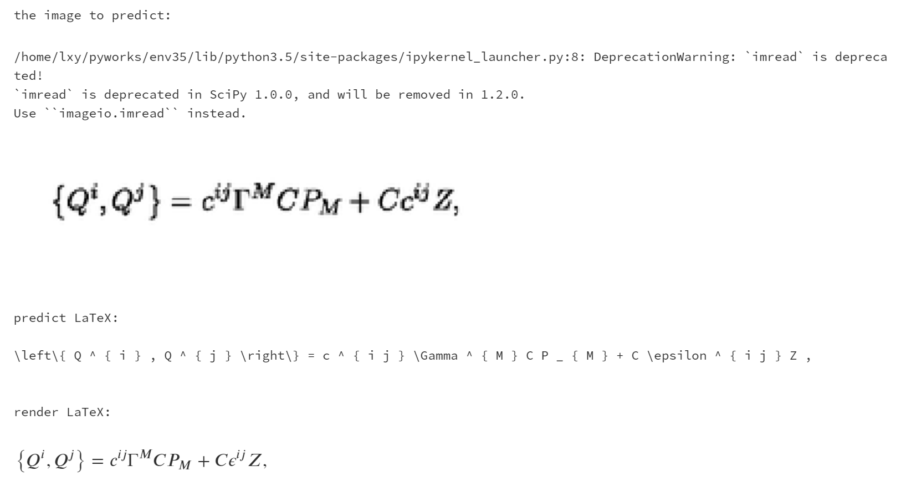
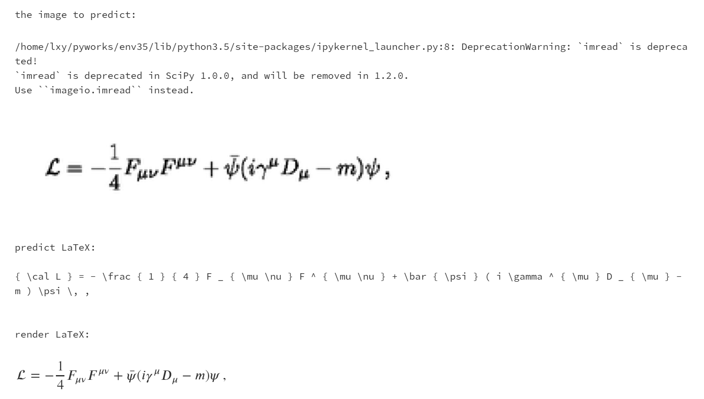
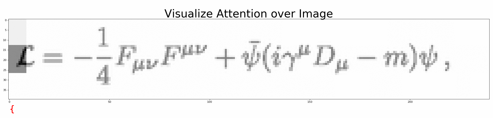
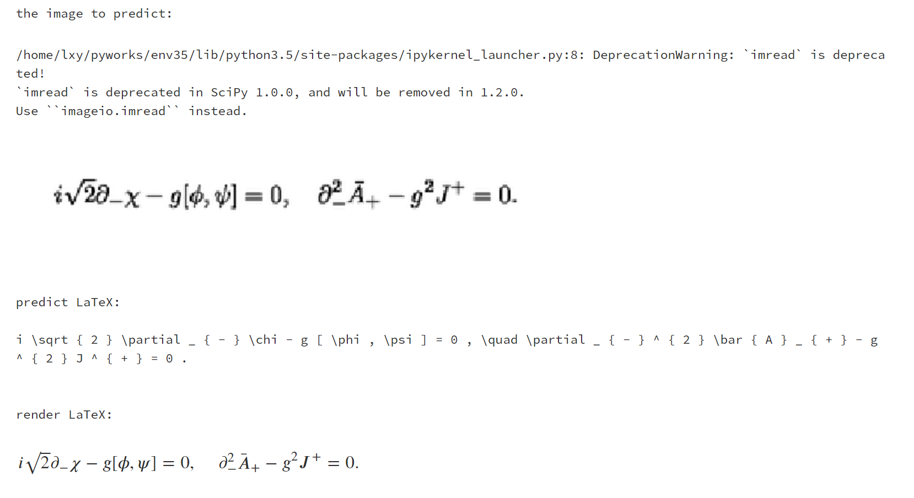

# LaTeX OCR

Seq2Seq + Attention + Beam Search







## 1. 搭建环境

1. python3.5 + tensorflow （latest）
2. latex (latex 转 pdf)
3. ghostscript
4. magick (pdf 转 png)

### Linux

一键安装
```shell
make install-linux
```
或
1. 安装本项目依赖
```shell
pip install -r requirements.txt
```
2. 安装 latex (latex 转 pdf)
```shell
sudo apt-get install texlive-latex-base
sudo apt-get install texlive-latex-extra
```
3. 安装 ghostscript
```shell
sudo apt-get update
sudo apt-get install ghostscript
sudo apt-get install libgs-dev
```
4. 安装[magick](https://www.imagemagick.org/script/install-source.php) (pdf 转 png)
```shell
wget http://www.imagemagick.org/download/ImageMagick.tar.gz
tar -xvf ImageMagick.tar.gz
cd ImageMagick-7.*; \
./configure --with-gslib=yes; \
make; \
sudo make install; \
sudo ldconfig /usr/local/lib
rm ImageMagick.tar.gz
rm -r ImageMagick-7.*
```

### Mac

一键安装

```shell
make install-mac
```

或
1. 安装本项目依赖
```shell
sudo pip install -r requirements.txt
```
2. LaTeX 请自行安装

3. 安装[magick](https://www.imagemagick.org/script/install-source.php) (pdf 转 png)

```shell
wget http://www.imagemagick.org/download/ImageMagick.tar.gz
tar -xvf ImageMagick.tar.gz
cd ImageMagick-7.*; \
./configure --with-gslib=yes; \
make;\
sudo make install; \
rm ImageMagick.tar.gz
rm -r ImageMagick-7.*
```
## 2. 开始训练

### 生成小数据集、训练、评价

提供了样本量为 100 的小数据集，方便测试。只需 2 分钟就可以根据 `./data/small.formulas/` 下的公式生成用于训练的图片。

一步训练

```
make small
```
或

1. 生成数据集

   用 LaTeX 公式生成图片，同时保存公式-图片映射文件，生成字典 __只用运行一次__

    ```shell
    # 默认
    python build.py
    # 或者
    python build.py --data=configs/data_small.json --vocab=configs/vocab_small.json
    ```

2. 训练
    ```
    # 默认
    python train.py
    # 或者
    python train.py --data=configs/data_small.json --vocab=configs/vocab_small.json --training=configs/training_small.json --model=configs/model.json --output=results/small/
    ```

3. 评价预测的公式
    ```
    # 默认
    python evaluate_txt.py
    # 或者
    python evaluate_txt.py --results=results/small/
    ```

4. 评价数学公式图片

    ```
    # 默认
    python evaluate_img.py
    # 或者
    python evaluate_img.py --results=results/small/
    ```


### 生成完整数据集、训练、评价

根据公式生成 70,000+ 数学公式图片需要 `2`-`3` 个小时

一步训练

```
make full
```
或

1. 生成数据集

   用 LaTeX 公式生成图片，同时保存公式-图片映射文件，生成字典 __只用运行一次__
    ```
    python build.py --data=configs/data.json --vocab=configs/vocab.json
    ```

2. 训练
    ```
    python train.py --data=configs/data.json --vocab=configs/vocab.json --training=configs/training.json --model=configs/model.json --output=results/full/
    ```

3. 评价预测的公式
    ```
    python evaluate_txt.py --results=results/full/
    ```

4. 评价数学公式图片
    ```
    python evaluate_img.py --results=results/full/
    ```
## 3. 可视化

### 可视化训练过程

用 tensorboard 可视化训练过程

小数据集

```
cd results/small
tensorboard --logdir ./
```

完整数据集

```
cd results/full
tensorboard --logdir ./
```
### 可视化预测过程

打开 `visualize_attention.ipynb`，一步步观察模型是如何预测 LaTeX 公式的。

或者运行

```shell
# 默认
python visualize_attention.py
# 或者
python visualize_attention.py --image=data/images_test/6.png --vocab=configs/vocab.json --model=configs/model.json --output=results/full/
```

可在 `--output` 下生成预测过程的注意力图。

## 4. 评价

|      指标       | 训练分数 | 测试分数 |
| :-------------: | :------: | :------: |
|   perplexity    |   1.39   |   1.44   |
|  EditDistance   |  81.68   |  80.45   |
|     BLEU-4      |  78.21   |  75.42   |
| ExactMatchScore |  13.93   |  12.44   |

perplexity 是越接近1越好，其余3个指标是越大越好。ExactMatchScore 比较低，继续训练应该可以到 70 以上。机器不太好，训练太费时间了。

## 4. 踩坑记录

### win10 用 GPU 加速训练

装驱动后就行了。运行下面代码进行训练：

```
C:/Users/dlink/AppData/Local/Programs/Python/Python35/python.exe train.py --data=configs/data.json --vocab=configs/vocab.json --training=configs/training.json --model=configs/model.json --output=results/full/
```

### 理想情况下输出数据应该按照一定规规律随着输入数据的变化而变化的，但是训练到最后，无论输入数据是多，输出数据都是一个数值，loss在来回跳动，没有减小。

遇到了这个问题，我的loss值最开始是在比较大的值上一直无法收敛，查看网络权值梯度，最开始的梯度返回已经是e-3级别了，因此网络基本没调整。

目前知道的方法有：

1. 初始化不对，查看每层网络的输入方差，如果方差越来越小，可以判定为初始化不对，而你的初始化也是采用的基本的高斯函数，有很大可能是初始化的问题；

2. 采用BN（批量标准化），可以稍微降低初始化对网络的影响；

3. 你的预测输出标签，而不是概率。如果你的数据是非常倾斜，1:20什么的，基本上不管怎么预测，预测标签都会是0。

4. 你的模型层数比较多，激活函数都是一样的。可以试试两层、三层的，效果如何。也可以换个激活函数试试。

最后解决: 这不是过拟合，这™是欠拟合，训练多个epoch就行。


## 致谢

论文：
1. [Show, Attend and Tell](https://arxiv.org/abs/1502.03044)
2. [Harvard's paper and dataset](http://lstm.seas.harvard.edu/latex/).

博客：

1. [Seq2Seq for LaTeX generation](https://guillaumegenthial.github.io/image-to-latex.html).